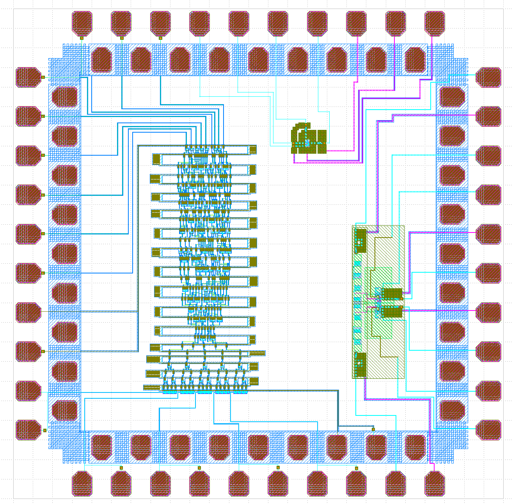

# Asynchronous Half-Adder Testchip Tapeout

## Overview

This project presents the custom physical design and verification of an asynchronous half-adder testchip implemented using an emerging technology.

## Physical Design Flow

Schematic Design → Custom Layout → Testbench Integration → DRC → LVS → Inductance Extraction → Post-Layout Verification → Final Testchip → Tapeout

## Design Highlights

* Custom multi-layer physical layout
* Device placement and interconnect routing
* Testbench integration
* Flux-trapping moat implementation
* DRC and LVS verification
* Inductance extraction
* Post-layout verification
* Testchip integration and tapeout

## Tools

* Cadence Virtuoso
* KLayout
* InductEx
* JoSIM
* WRspice
* Linux

## Physical Layout of Half Adder 

**Figure 1.** Physical layout of the asynchronous half adder.

##  DRC of Half Adder Physical Layout

## Physical Layout Half Adder in Testbench 

**Figure 2.** Physical layout of the asynchronous half adder testbench.

## Final Testchip 

**Figure 3.** Final integrated testchip layout prepared for tapeout.

