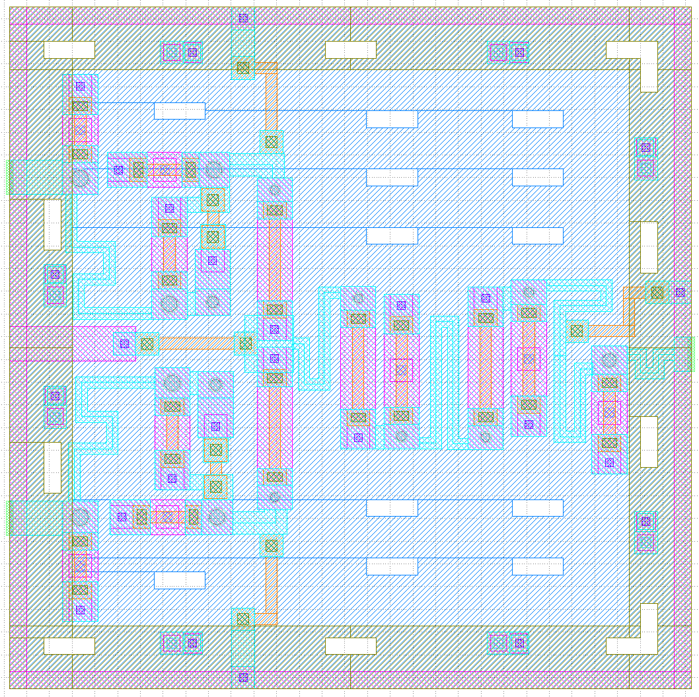

# Novel Asynchronous XOR Gate

## Overview

This project presents the custom physical layout and design rule verification of a novel asynchronous XOR gate implemented using an emerging technology.

## Design Highlights

* Custom multi-layer physical layout
* Device placement and interconnect routing
* Flux-trapping moat integration
* Design Rule Checking (DRC)

## Tools

* Cadence Virtuoso
* KLayout
* InductEx
* JoSIM
* WRspice
* Linux

## XOR Physical Layout

**Figure 1.** Physical layout of the novel asynchronous XOR gate.

## Design Rule Checking (DRC)

